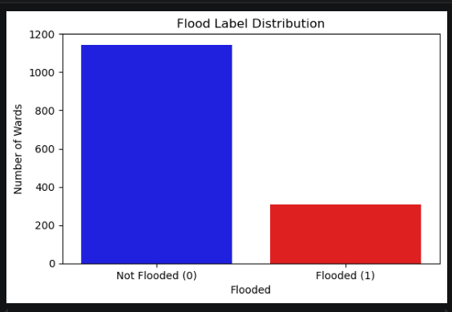
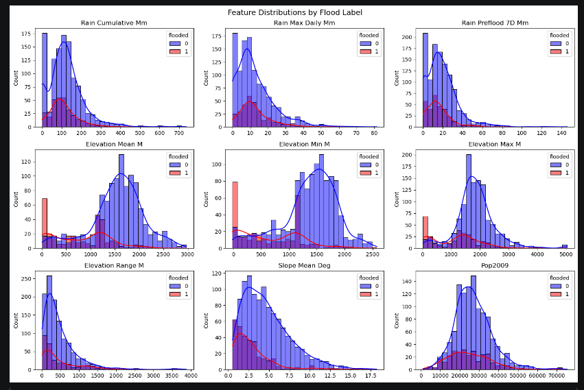
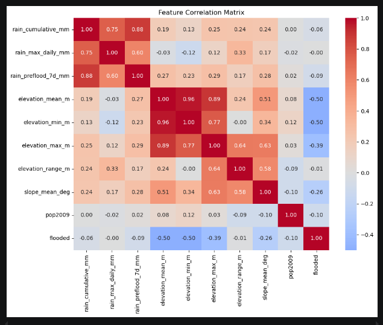
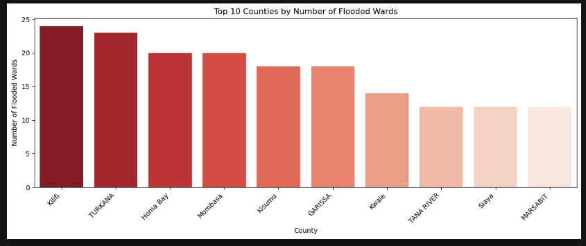
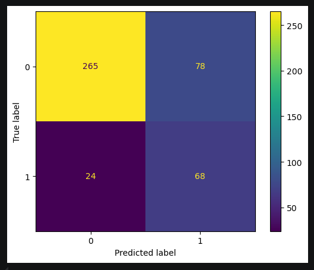
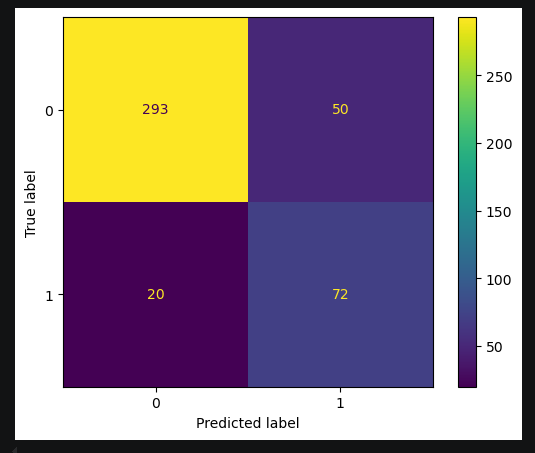
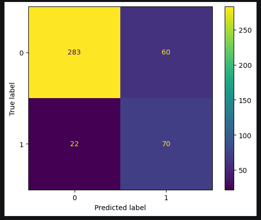
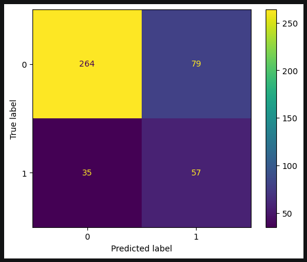
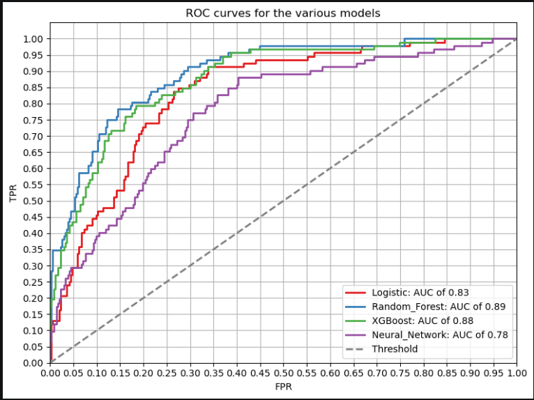
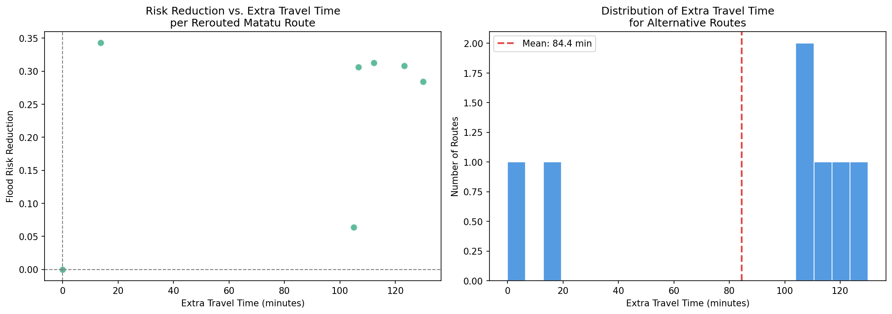

---

<h1 align='center'>
NAIROBI FLOOD GUARD
</h1>

> **Authors**: Group 4

---

<h2 align='center'>
1. OVERVIEW
</h2>

Nairobi Flood Guard is a data science project that addresses the growing threat of flooding across Kenya, motivated by the devastating April 2024 floods and the recent 2026 floods

It has two components:

- **A flood susceptibility model** and

- **A matatu route optimization system**

It is built using open data and reproducible tools

---

<h2 align='center'>
2. BUSINESS UNDERSTANDING
</h2>

### _Problem Statement_

Flooding in Nairobi is extremely disruptive and leads to loss of life, displacement, and infrastructure damage. Current flood response is largely reactive than predictive

### _Objectives_

- **Flood Susceptibility Prediction**

- **Matatu Route Optimization**

## _Stakeholders_

- Kenya Red Cross / National Disaster Management Unit

- Nairobi City County

- Matatu operators and SACCOs

- General public in flood-prone wards

## _Success Metrics_

- High **recall**

- Route recommendations that successfully avoid confirmed flood zones

- Ward-level risk scores that align with known historically flooded areas

## _Scope and Limitations_

- Labels are based on a single flood event

- GTFS data is from 2019

- Ward-level predictions are coarse

- The model predicts **susceptibility** not exact flood timing or depth

---

 <h2 align='center'>
 3. DATA UNDERSTANDING
 </h2>

This project utilises five datasets, each contributing a different dimension to the flood prediction and route optimization pipeline

### a) SRTM Digital Elevation Model (DEM)

The Shuttle Radar Topography Mission (SRTM) DEM provides elevation data at 90 metre resolution. It was used to derive four terrain features per ward: mean elevation, minimum elevation, maximum elevation, and slope

**Source**: OpenTopography (SRTM GL3 product)

### b) CHIRPS Rainfall Data

The Climate Hazards Group InfraRed Precipitation with Station Data (CHIRPS) provides daily rainfall estimates at approximately 5km resolution. Ninety daily rasters covering February-April 2024 were used to derive three rainfall features per ward: cumulative rainfall, maximum single-day rainfall, and total rainfall in the seven days preceding the April 26 flood event

**Source**: UCSB Climate Hazards Group

### c) UNOSAT Flood Extent - FL20240426KEN

A satellite-derived flood extent geodatabase produced by UNOSAT following the April 2024 Kenya floods. The Kenya-wide maximum flood water extent polygon was used to generate binary flood labels for each ward - flooded (1) or not flooded (0).

**Source:** UNOSAT / UNITAR

### d) Kenya Wards Shapefile

A polygon shapefile of Kenya's 1450 administrative wards including ward name, sub-county, county, and 2009 census population. This served as the spatial backbone of the project - all raster datasets were aggregated to ward level through spatial joins and zonal statistics.

**Source:** Regional Centre for Mapping of Resources for Development (RGMRD)

### e) GTFS Feed 2019 - Nairobi Matatu Network

A General Transit Feed Specification (GTFS) dataset describing Nairobi's matatu public transport network as of 2019, including 136 routes, 4,284 stops, and 36,483 route shape points. This dataset underpins the route optimization component of the project.

**Source:** Digital Matatus Project

### f) Compiled Feature Matrix - floods.gpkg

All datasets were processed and merged into a single GeoPackage file (`floods.gpkg`) containing one row per ward with all features and the flood label. More information about about the compiled feature matrix can be found [here](./Data/floods_description.md).

### _EDA_

After loading and examining the dataset (checking for null values and duplicates), the following visualizations were developed:

#### i) Class Imbalance visualization



The not flooded class accounts for ~79% of the data in the dataset. This confirms that the dataset suffers from class imbalance which was addressed.

#### ii) Feature distributions



The feature distribution plots reveal that flooded wards receive less rainfall than non-flooded ones suggesting that, at ward scale, rainfall intensity is a weak standalone predictor of flooding. The elevation features show the clearest separation and are better predictors.

#### iii) Correlation heatmap



The correlation heatmap confirms the previous observations. Elevation features dominate - `elevation_min_m` and `elevation_mean_m` carry the strongest negative correlations with flooding (-0.50 and -0.50 respectively), followed by `elevation_max_m` (-0.39) and `slope_mean_deg` (-0.26).

All rainfall features correlate weakly with flooding, with `rain_max_daily_mm` showing virtually no linear relationship (-0.001). The heatmap also reveals high inter-correlation between the three elevation features.

#### iv) Top 10 most flooded counties



Again, some of the top 10 counties are ones that do not receive a lot of rainfall e.g. Turkana and Garissa. They experience flooding due to their terrain which does not allow the water to drain effectively during those rare seasons when it does rain.

#### _Key Takeaway_

The dataset reveals that in Kenya, flooding is primarily a terrain-driven phenomenon at the ward scale. Low-lying wards flood not necessarily because they receive more rain, but because water from surrounding higher ground drains into them. Terrain features will dominate predictions, and rainfall adds marginal value at this spatial scale.

---

<h2 align='center'>
4. MODEL BUILDING AND EVALUATION
</h2>

Four classification model families were independently developed and tuned by the project team, each in its own dedicated notebook located in the `Model/Notebooks/` directory:

a) [Logistic Regression](./Models/Notebooks/logistic_notebook.ipynb) (baseline) - saved [here](./Models/best_logistic_model.pkl)

b) [Random Forest Classifier](./Models/Notebooks/random_forest_notebook.ipynb) - saved [here](./Models/best_random_forest_model.joblib)

c) [XGBoost Classifier](./Models/Notebooks/XGBoost_notebook.ipynb) - saved [here](./Models/best_xgboost_model.pkl)

d) [Neural Network](./Models/Notebooks/neural_notebook.ipynb) - saved [here](./Models/best_neural_model.keras)

Each model was iteratively improved through hyperparameter tuning, regularisation, and class imbalance handling before the best version was saved.

The following results were obtained:

### a) Logistic Regression (Baseline)



The baseline logistic regression model did not show strong recall on the flooded class, with more than half of its predicted positives being false positives. It showed strong overall recall by keeping false negatives low. This set a solid performance floor for the more complex models to beat.

### b) Random Forest Model



The Random Forest improved on the baseline across all metrics. Its ensemble nature - aggregating predictions from many decision trees - allowed it to capture non-linear relationships between terrain features and flood risk that the logistic regression cannot.

### c) XGBoost Classifier Model



The XGBoost model performed better relative to the Random Forest on this dataset in terms of recall. It also had a high accuracy, precision and f1-score. This is likely attributable to its ensemble nature which, like the Random Forest, allowed it to capture non-linear relationships between terrain features and flood risk

### d) Neural Network



The Neural Network significantly underperformed relative to the Random Forest and XGBoost model. Neural networks typically require large amounts of training data to generalise well - with only 1,450 ward-level samples, the model had limited capacity to learn complex spatial patterns compared to tree-based ensembles.

### _Final Evaluation_

Comparing the metrics of all the models:

| Model          |      AUC | accuracy | precision |   recall | f1-score | support |
| :------------- | -------: | -------: | --------: | -------: | -------: | ------: |
| Logistic       |  0.69898 | 0.689655 |   0.60063 | 0.632194 | 0.604335 |     435 |
| Neural_Network | 0.777919 | 0.737931 |   0.65103 | 0.694622 | 0.661215 |     435 |
| Random_Forest  | 0.881322 | 0.822989 |  0.742775 | 0.792306 | 0.760649 |     435 |
| XGBoost        | 0.896913 | 0.813793 |  0.742293 | 0.818291 | 0.762601 |     435 |

The **XGBoost model** achieved some of the highest metrics among all four models

Given that we were looking for the model with the best recall, and, combined with the fact that it had the best AUC and F1-Score, the **XGBoost model** was selected as the final model for flood susceptibility prediction.

The models' ROC curves reinforce this decision with XGBoost achieving the highest AUC (0.9):



---

<h2 align='center'>
5. ROUTE OPTIMIZATION
</h2>

### Overview

With the XGBoost model identified as the best performer, its flood probability predictions were used to power a matatu route optimization system for Nairobi. The full implementation is in `Route_Optimization/route_optimization.ipynb` ([here](./Route_Optimization/route_optimization.ipynb)). This section summarises the methodology, key outputs, and findings.

The system works in four stages:

1. **Flood probabilities given to road edges** - each road segment in Nairobi's OpenStreetMap network is assigned the flood probability of the ward it passes through via a spatial join

2. **Flood-weighted Dijkstra** - each edge is penalized using the formula `cost = travel_time × (1 + α × flood_probability)`, where $\alpha$ controls the strength of the penalty. Setting $\alpha$ to 1,000,000 acts as a practical infinity - any road with non-zero flood probability becomes impassable for routing purposes. The algorithm then finds the path that minimises total cost, effectively blocking flooded roads from consideration entirely - a route is only returned if a completely flood-free path exists between the terminal stops.

   This is done so as to avoid suggesting a flooded path even as an alternative.

3. **GTFS-RT feed** — rerouting decisions are packaged as a production-ready GTFS-RT protobuf feed with `TripUpdate` messages for each affected trip, consumable by transit apps such as Google Maps and Transit App.

4. **Folium map** — an interactive map that visualises ward flood risk, affected stops, and original vs. alternative route paths side by side.

| route_id    | origin        | destination        | original_flood_prob | alternative_flood_prob | risk_reduction | original_time_s | alternative_time_s | extra_time_min |
| :---------- | :------------ | :----------------- | ------------------: | ---------------------: | -------------: | --------------: | -----------------: | -------------: |
| 20104003910 | Super Highway | Transami           |               0.067 |                  0.003 |          0.064 |         1469.63 |             7772.5 |            105 |
| 30603373812 | Dune          | Rounda             |               0.306 |                  0.022 |          0.284 |         868.318 |            8671.07 |            130 |
| 40705383911 | Quickmart     | Muthurwa           |               0.342 |                  0.028 |          0.313 |         1479.57 |            8216.55 |          112.3 |
| 50700003311 | Utawala       | Kencom/Ambassadeur |               0.315 |                  0.009 |          0.306 |         1494.09 |            7898.88 |          106.7 |
| 50700014501 | Ruiru         | Ruai Bypass        |               0.122 |                  0.122 |              0 |         1108.48 |            1108.48 |              0 |
| 50700033H01 | By Pass       | Cabanas            |               0.317 |                  0.009 |          0.308 |         1083.11 |             8475.9 |          123.2 |
| 50703033J01 | Githunguri    | Cabanas            |               0.378 |                  0.035 |          0.343 |         881.788 |            1704.78 |           13.7 |

The table above shows the top 10 most improved matatu routes ranked by flood risk reduction. Each row represents one route and shows:

- **Original flood risk** - the average flood probability across road segments on the standard route

- **Alternative flood risk** - the same metric for the recommended alternative path

- **Risk reduction** - the absolute improvement; higher is better

- **Extra travel time** - the additional journey time the alternative route adds in minutes, representing the safety-convenience tradeoff

Routes with high risk reduction and low extra travel time are the most actionable recommendations - they offer meaningful safety improvements at minimal inconvenience to operators and commuters.



The scatter plot (left) shows the tradeoff between flood risk reduction and extra travel time for each rerouted route. Routes in the upper-left quadrant are ideal — they achieve large risk reductions with little added journey time. Routes in the lower-right represent cases where the algorithm found an alternative path, but the safety gain is marginal relative to the detour cost.

The histogram (right) shows the distribution of extra travel time across all rerouted routes. The majority of alternatives add a significant amount of time, suggesting that for most affected matatu routes, there does not exist a safer path that is not significantly longer than the original. These options, while not convenient, offer a lot more safety. The mean extra travel time is marked by the red dashed line.

> To view the folium map run the streamlit website in `app.py` by typing `streamlit run app.py` in your terminal. More information on this is provided in the section `For More Information` below

### Conclusion

The route optimization system demonstrates that for the majority of Nairobi's flood-affected matatu routes, safer alternatives exist. However, most of them add significant travel time. The GTFS-RT feed produced by this system is immediately compatible with existing transit infrastructure, requiring no changes to operator hardware or passenger apps to deploy.

---

<h2 align='center'>
6. CONCLUSION AND RECOMMENDATION
</h2>

### Conclusion

Nairobi Flood Guard set out to address two problems: predicting which areas of Kenya are most susceptible to flooding, and recommending safer matatu routes when flood events occur. Both objectives were successfully achieved.

The data understanding phase revealed an important and counterintuitive insight: flooding in Kenya at ward scale is primarily a **terrain-driven phenomenon**, not a rainfall-driven one. Low-lying wards flood not because they receive more rain, but because water from surrounding higher ground drains into them. This meant that elevation features dominated model performance while rainfall features contributed marginally, a finding that shaped feature engineering decisions across all four models.

Among the four model families evaluated - Logistic Regression, Random Forest, XGBoost, and Neural Network - the **XGBoost model emerged as the best overall performer**, achieving the highest AUC (0.90) and recall among all models. Its ability to handle non-linear relationships, class imbalance, and noisy features made it well-suited to this dataset. The Neural Network underperformed relative to the tree-based models, consistent with its need for larger datasets than the 1,450 ward-level samples available here.

The route optimization system translated XGBoost's flood probability predictions into actionable rerouting recommendations for Nairobi's matatu network. By assigning prohibitively high costs to flood-affected road segments and running weighted Dijkstra across the real OpenStreetMap road network, the system identified safer alternative paths for affected routes - packaged in a production-ready GTFS-RT feed compatible with existing transit infrastructure.

### Recommendations

#### 1. Running the Flood Prediction Model

To generate flood risk predictions, load `Models/best_xgboost_model.pkl` and, after ensuring that the feature names are in the right order, call `predict_proba()` on the model. The full prediction workflow is documented in `Notebooks/xgboost_notebook.ipynb`. Ensure the input data contains all required columns from `Data/floods.gpkg` before engineering features.

#### 2. Running the Route Optimization System

The route optimization notebook at `Route_Optimization/route_optimization.ipynb` is self-contained and can be run independently. It requires `Data/floods.gpkg`, `Data/nairobi_road_network.graphml`, `Data/GTFS_FEED_2019/`, and `Models/best_xgboost_model.pkl` to be present. The notebook loads the saved road network from disk — there is no need to re-download it from OpenStreetMap. Outputs are saved to `Route_Optimization/Reports/`.

#### 3. Tuning the Flood Risk Threshold

The system flags wards as high-risk at a default probability threshold of 0.45, set via the `FLOOD_THRESHOLD` constant in the route optimization notebook. This can be lowered to increase sensitivity (flag more wards as at-risk) or raised to reduce false alarms, depending on the severity of the flood event being modelled. During extreme events, a lower threshold is recommended.

#### 4. Adjusting the Alpha Parameter

`ALPHA` in the route optimization notebook controls how aggressively flooded roads are penalized. The current setting of 1,000,000 effectively blocks all flood-affected roads. For scenarios where partial flooding is expected and roads remain passable, lowering alpha to 5 - 10 introduces a preference for safer roads without outright blocking them.

#### 5. Familiarizing Yourself With the Project

You should begin by reading and running `notebook.ipynb` for a full project overview. Feature engineering logic is centralised in `Utils/feature_engineering.py` - any changes to features must be reflected there to ensure consistency across the prediction and route optimization pipelines. Individual model notebooks are in `Models/Notebooks/` and can be run independently for retraining or further tuning.

---

<h2 align='center'>
7. NEXT STEPS
</h2>

1. Expand the flood label dataset

2. Incorporate real-time rainfall data

3. Update the GTFS feed

4. Add flood depth estimation

5. Deploy as a live API

6. Conduct ground-truth validation

---

<h2 align='center'>
8. FOR MORE INFORMATION
</h2>

For more information visit the:

- [Main Notebook](./notebook.ipynb)
- [Model Notebooks](./Models/Notebooks/)
- [Route Optimization Notebook](./Route_Optimization/route_optimization.ipynb)
- [Presentation](./presentation.pdf)

### _Instructions on how to run the streamlit app_

Ensure you have streamlit installed. To check if you do, you can run this in your terminal:

```bash
streamlit --version
```

If you do not have it installed, install it using either:

- pip:

  ```bash
  pip install streamlit
  ```

- or conda:

  ```bash
  conda install -c conda-forge streamlit
  ```

and then in your terminal run:

```bash
streamlit run app.py
```
